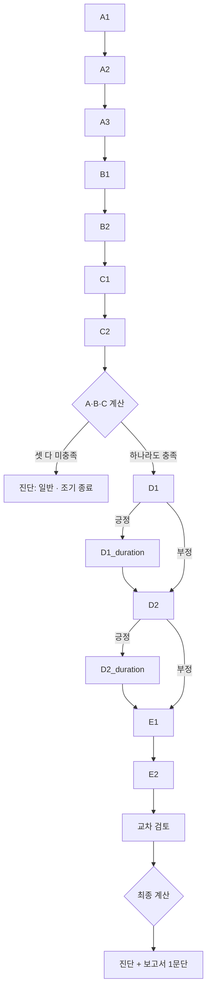

# 고립 챗봇 면담 흐름

13문항, 판정 기준(cut-off), 분기, 진단 규칙을 코드(`interview_flow.json`, `backend/interview/prompts.py`, `backend/interview/scorecard.py`, `backend/interview/engine.py`)에서 그대로 옮긴 문서다. 코드가 바뀌면 이 문서도 같이 고친다.

## 환영 메시지

모든 면담은 같은 안내로 시작한다. 모델이 쓰지 않고 `backend/interview/welcome.py`에 고정해 두며, 말풍선 두 개가 첫 메시지들로 저장된 뒤 첫 질문(A1)이 이어진다 — 질문까지 말풍선 세 개.

1. 안녕하세요, 반갑습니다. 저는 이 면담을 진행하는 AI입니다. 최근 한 달 동안 어떻게 지내셨는지 열 가지 남짓 여쭤볼게요.
2. 질문마다 아래 보기에서 고르시거나 직접 입력하시면 됩니다. 정답은 없으니 편하게 답해 주세요. 10분 안팎이면 끝납니다.
3. (첫 질문)

환영 메시지는 면담이 실제로 할 수 있는 것만 약속한다. 진행자의 말은 고정된 질문 원문으로만 나가서 참가자의 질문에 답할 수 없으므로 "궁금한 점은 물어보셔도 됩니다"는 넣지 않았다. "10분 안팎"은 추정이며 파일럿에서 실제 소요 시간을 재서 맞춘다.

화면은 진행자의 새 말(환영 메시지와 매 턴의 다음 질문)을 글자 단위로 흘려 보여 준다. 서버는 한 턴을 한 번에 응답하므로 이 스트리밍은 화면에서 만든 것이다. 이어서 들어온 면담과 참가자 본인의 말은 한 번에 보이고, 글자가 다 나올 때까지 입력창과 보기는 잠긴다. "동작 줄이기" 설정에서는 스트리밍하지 않는다.

## 흐름

- 질문은 반드시 한 번에 하나씩 한다.
- 모호한 답에는 공감 표현으로 시작하는 재질문을 한다. **같은 문항 최대 3회**, 넘기면 `negative`로 기입한다 (E1·E2 제외).
- `value`는 12자 이내 코드값이어야 한다 (`예`, `주 2회`, `0명`, `12개월`, `7점`). 참여자의 문장은 근거(rationale)와 대화 기록에 남는다. E1·E2만 문장을 그대로 담는다.

## 문항과 판정 기준

| 순서 | ID | 질문 | 유형 | 긍정(positive) | 부정(negative) | 재질문 |
|---|---|---|---|---|---|---|
| 1 | A1 | 지난 1달 동안, 하루 중 대부분, 거의 매일 집 혹은 방에서 시간을 보냈습니까? | 예/아니요 | 예 | 아니요 | 모호할 때 |
| 2 | A2 | 지난 1달 동안, 일주일에 평균적으로 몇 번 외출하였습니까? (분리수거·생필품 구매 제외) | 횟수 | **주 4회 미만** | 주 4회 이상 | 숫자를 알 수 없을 때만 |
| 3 | A3 | 이러한 기간이 얼마나 오래 지속되었습니까? (예: 3개월, 6개월, 1년) | 기간 | **6개월 이상** | 6개월 미만 | 기간이 불명확할 때 |
| 4 | B1 | 지난 1달 동안 직장 또는 사적 영역에서 유의미한 상호작용을 꾸준히 지속한 사람이 몇 명입니까? (동거인·가족 제외, 온라인만의 관계 제외, 0명 가능) | 인원 | **0명** | 1명 이상 | 숫자가 불명확할 때 |
| 5 | B2 | 이러한 기간이 얼마나 오래 지속되었습니까? | 기간 | **3개월 이상** | 3개월 미만 | 기간이 모호하거나 추론에 의존할 때 |
| 6 | C1 | 지난 1달 동안, 필요할 때 의지할 수 있는 사람이 몇 명입니까? (0명 가능, 온라인만/동거인/가족 제외) | 인원 | **0명** | 1명 이상 | 수를 알 수 없을 때 |
| 7 | C2 | 그러한 상태가 얼마나 오래 지속되었습니까? | 기간 | **3개월 이상** | 3개월 미만 | 기간이 모호할 때 |
| 8 | D1 | 지난 1달 동안, 고립된 생활로 인해 정서적 고통을 느꼈습니까? (또는 주변 사람이 고통을 느꼈습니까?) 느꼈다면 1~10점은 몇 점입니까? | 점수 | 고통 있음 명시 또는 **5점 이상** | 없음 또는 4점 이하 (없다고 하면 0점) | 점수 없이 고통만 말하면 1~10 범위를 명시해 점수 요청 |
| 9 | D1_duration | 그러한 정서적 고통은 얼마나 오래 지속되었습니까? | 기간 | **3개월 이상** | 3개월 미만 | 모호할 때. **D1이 부정이면 건너뜀** |
| 10 | D2 | 지난 1달 동안, 고립된 생활이 학업/직업/구직/양육/일상 기능(위생·식사 등)에 부정적 영향을 미쳤습니까? 미쳤다면 1~10점은 몇 점입니까? | 점수 | 영향 있음 명시 또는 **5점 이상** | 없음 또는 4점 이하 (없다고 하면 0점) | 점수가 없거나 영향이 모호할 때 |
| 11 | D2_duration | 그러한 기능 손상은 얼마나 오래 지속되었습니까? | 기간 | **3개월 이상** | 3개월 미만 | 모호할 때. **D2가 부정이면 건너뜀** |
| 12 | E1 | 정서적/정신과적 문제로 심리 평가나 상담을 받은 적이 있습니까? (있다면 언제, 무엇 때문이었나요?) | 자유 응답 | 판정 없음 (`recorded`) | — | 재질문 한도 없음 |
| 13 | E2 | 내외과적 신체 질환으로 진단 또는 치료를 받은 적이 있습니까? (있다면 언제, 무엇 때문이었나요?) | 자유 응답 | 판정 없음 (`recorded`) | — | 재질문 한도 없음 |

B1·C1에서 세지 않는 사람: 동거인, 가족, 온라인으로만 아는 관계, 점원·의사 같은 일방적 서비스 관계, 인사만 하거나 수업만 같이 듣는 관계.

## 기준과 진단

| 기준 | 충족 조건 |
|---|---|
| A (칩거) | A3 긍정 **그리고** (A1 긍정 또는 A2 긍정) |
| B (상호작용 결핍) | B1 긍정 그리고 B2 긍정 |
| C (지지 결핍) | C1 긍정 그리고 C2 긍정 |
| D (고통·기능 손상) | (D1 긍정 그리고 D1_duration 긍정) **또는** (D2 긍정 그리고 D2_duration 긍정) |

| 결과 | 조건 |
|---|---|
| **히키코모리** | A, B, C, D 모두 충족 |
| **사회적 고립** | B, C, D 충족 (A 미충족) |
| **일반** | 그 외 |
| **일반 · 조기 종료** | C2까지 기입한 뒤 A·B·C가 셋 다 미충족이면 D·E를 묻지 않고 종료 |

## 교차 검토

모든 문항을 기입한 뒤 답변 전체의 일관성을 본다 (E1·E2 포함). 예: A1 "하루 종일 집에 있음"인데 A2 "주 5회 외출"이면 불일치. 불일치가 보이면 해당 문항을 `clear` → 재질문 1개 → 다시 `record`. 항목당 재질문은 1회. 검토가 끝나면 최종 계산 후 보고서 1문단을 쓰고 종료한다.

## 추천 답변

입력창 바로 위, 참가자 쪽(오른쪽)에 지금 묻는 문항의 추천 답변이 뜬다. 참가자 말풍선과 같은 모양에 테두리만 있는 형태로, "아직 보내지 않은 내 말"처럼 보이게 했다. 위에 "아래에서 고르거나 직접 입력하세요"라는 안내가 붙는다. 목록은 `backend/interview/suggestions.py`에 있고 참가자 응답의 `suggestedReplies`로 내려간다.

| 유형 | 문항 | 보기 | 비고 |
|---|---|---|---|
| 예/아니요 | A1 | 예, 대부분 집이나 방에서 보냈어요 · 아니요, 밖에서 보낸 시간이 더 많았어요 | 문장형. 두 보기의 길이와 말투를 맞춰 어느 쪽도 기대되는 답처럼 보이지 않게 한다 |
| 횟수 | A2 | 주 3회 이하 · 주 4회 이상 | 경계가 4회. "3회 미만"으로 쓰면 정확히 3회인 사람이 고를 보기가 없어지므로 "이하"로 쓴다 |
| 인원 | B1, C1 | 0명 · 1명 · 2명 · 3명 이상 | 경계가 0명 |
| 기간 | A3, B2, C2, D1_duration, D2_duration | 1개월 미만 · 1~3개월 · 3~6개월 · 6개월~1년 · 1년 이상 | A3는 6개월, 나머지는 3개월이 경계라 이 다섯 칸이면 모두 가른다 |
| 점수 | D1, D2 | 없음 · 1점 ~ 10점 | "없음"은 0점으로 기입 |
| 자유 응답 | E1 | 아니요, 받은 적 없어요 · 네, 받은 적 있어요 | "네…"는 전송하지 않고 입력창에 넣어 이어 쓰게 한다 |
| 자유 응답 | E2 | 아니요, 없어요 · 네, 있어요 | 위와 같음 |

숫자 문항은 짧은 값을 유지한다. 보기가 5~11개라 문장으로 만들면 화면을 덮는다.

**누른 답은 기록에 표시된다.** 문장형 보기를 누르면 대화 기록에 유창한 문장이 남아, 검토자가 참가자가 직접 쓴 말로 오해할 수 있다. 그래서 답변 메시지마다 `source`(`typed` 또는 `suggested`)를 저장한다. 서버는 "그 순간 실제로 제시된 보기와 글자 그대로 같은 답"만 `suggested`로 인정한다. 대화 기록 화면과 검토 화면의 답변 칸에 "보기에서 선택"으로 나오고, CSV에는 `answer` 옆 `answerSource` 열로 나간다. 이 기능 이전의 답변은 값이 비어 있다.

보기를 눌러도 **자유 입력은 항상 남겨 둔다.** 이 면담은 반구조화 면담이라 참여자의 말이 근거로 남아야 하고, 보기만 있으면 설문지가 되어 원래 도구와 비교 가능성이 흔들린다.
